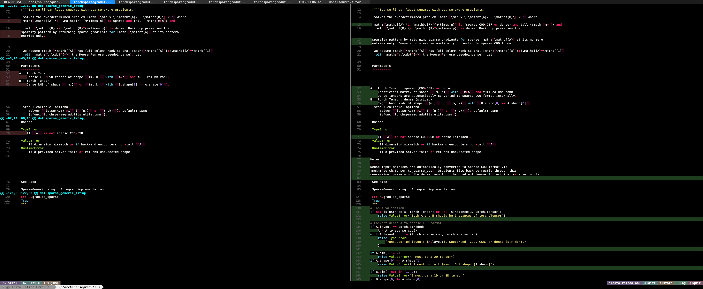
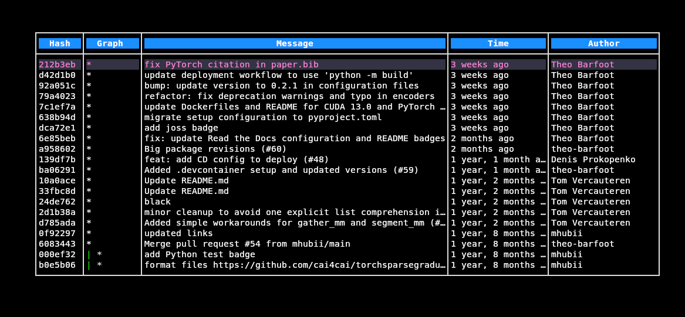

# Git Gui (GG)

A simple GUI for Git in Go.

## Features

- **Syntax highlighting** - Full syntax highlighting for languages (yet to create tracking for this)
- **Side-by-side view** - Compare old and new code directly alongside each other
- **Tabbed interface** - Easy navigation between multiple changed files
- **Statistics view** - Press `s` to see git diff --stat style summary
- **Color-coded help bar** - Each keyboard shortcut displayed in distinct dark pastel colors for quick reference
- **Line numbers** - See exact line numbers for both versions
- **Full scrolling** - Navigate with vim-style keybindings (j/k, arrows, page up/down)

## Installation

```bash
curl -fsSL https://raw.githubusercontent.com/aymuos15/GitGUI/master/install.sh | bash
```

Installs to `~/bin`. Make sure `$HOME/bin` is in your PATH.

## Screenshots

### Side-by-Side Diff View



*The main diff view displays code changes side-by-side with full syntax highlighting. Deletions are shown on the left (red background), additions on the right (green background). Navigate between multiple changed files using tabs at the top.*

### Git Log View



*Browse your commit history in an interactive table format. View commit hashes, messages, timestamps, and authors with a visual graph representation of the commit history.*

### Statistics View


*Press `s` to see a summary of all changes organized by file. The statistics view shows file status, addition counts (green), and deletion counts (red) for a quick overview of your changes.*

